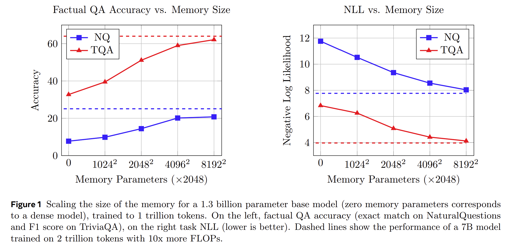

# Memory Layers

This repo contains a reference implementation of the paper [memory Layers at Scale](https://ai.meta.com/research/publications/memory-layers-at-scale/).

<p align="center">  
 
</p>

## Quick start

The following commands launch a SLURM job that creates an environment for Meta Lingua.
The env creation should take around 5 minutes without counting downloads. 

```bash
git clone https://github.com/facebookresearch/memory
cd memory

bash setup/create_env.sh
# or if you have access to a SLURM cluster
sbatch setup/create_env.sh
```
Once that is done your can activate the environment 
```bash
conda activate lingua_<date>
```
use the provided script to download and prepare data from huggingface (among `fineweb_edu`, `fineweb_edu_10bt`, or `dclm_baseline_1.0`).
This command will download the `fineweb_edu` and prepare it for training in the `./data` directory, specifying the amount of memory `terashuf` (the tool used to shuffle samples) will be allocated.
```bash
python setup/download_prepare_hf_data.py fineweb_edu <MEMORY> --data_dir ./data --seed 42
```
to download tokenizer (here llama3), use the folowing script:
```bash
python setup/download_tokenizer.py llama3 <SAVE_PATH> --api_key <HUGGINGFACE_TOKEN>
```
Now launch a debug job to check if everything works.  **The provided configurations are templates, you need to adapt them for them to work (change `dump_dir`, `data.root_dir`, `data.tokenizer.path`, etc ...)**

```bash
# stool stands for SLURM tool !
python -m lingua.stool script=apps.main.train config=apps/main/configs/pkplus_373m_1024k.yaml nodes=1 partition=<partition>
# if you want to launch locally you can use torchrun
torchrun --nproc-per-node 8 -m apps.main.train config=apps/main/configs/pkplus_373m_1024k.yaml
# or you can also launch on 1 GPU
python -m apps.main.train config=apps/main/configs/pkplus_373m_1024k.yaml

## Project overview

The main changes to the lingua code are in the following locations

```
📦meta-lingua
 ┣ 📂lingua # Core library
 ┃ ┣ 📂product_key # Main folder for memory layer implementation
 ┃ ┃ ┣ 📜colwise_embeddingbag.py  # memory parallelization code
 ┃ ┃ ┣ 📜memory.py  # core implementation
 ┃ ┃ ┗ 📜xformer_embeddingbag.py  # fast embedding_bag implementation
 ┃ ┣ 📜distributed.py
 ┃ ┗ 📜transformer.py
 ┗ 📂apps # Apps that put components together
   ┣ 📂main # Main language modeling app with llama
   ┃ ┣ 📂configs
   ┃ ┣ 📜train.py
   ┃ ┗ 📜transformer.py
```


## Configuration

See `apps/main/configs/pkplus_373m_1024k.yaml` for an example configuration.

## Launching jobs locally

```bash
torchrun --nproc-per-node 8 -m apps.main.train config=apps/main/configs/pkplus_373m_1024k.yaml
```

### Launching with SLURM

Since we want to do distributed training, we need `train.py` to run N times (with N being the number of GPUs)

The easiest way to do this is through SLURM. And in order to make that simpler, we provide `lingua/stool.py` which is a simple python script that 
1. Saves the provided config to `dump_dir`
2. Copies your current code to `dump_dir` in order to back it up 
3. Creates an sbatch file `submit.slurm` which is then used to launch the job with the provided config. 

It can be used through command line 

```bash
python -m lingua.stool config=apps/main/configs/pk_7b.yaml nodes=1 account=fair_amaia_cw_codegen qos=lowest
```

## Evaluations

Evaluations can run either during training periodically or you directly launch evals on a given checkpoint as follows:

```bash
srun -n 8 python -u -m apps.main.eval config=apps/main/configs/eval.yaml
```

You need to specify the checkpoint and dump dir of the evaluation in that config

Or through `stool` with

```bash
python -m lingua.stool script=apps.main.eval config=apps/main/configs/eval.yaml nodes=1 account=fair_amaia_cw_codegen qos=lowest
```

## Related repositories

This code is mostly copied from [Meta Lingua](https://github.com/facebookresearch/lingua) and the changes relevant to our new memory architecture are mainly located under `lingua/product_key`. The product key implementation was initially based on [XLM](https://github.com/facebookresearch/XLM/tree/main/xlm/model/memory).  Please refer to [Meta Lingua](https://github.com/facebookresearch/lingua) README for more instructions.

## Citation

```
@misc{meta_lingua,
  author = {Vincent-Pierre Berges, Barlas Oguz, Daniel Haziza, Wen-tau Yih, Luke Zettlemoyer, Gargi Gosh},
  title = {Memory Layers at Scale},
  url = {https://github.com/facebookresearch/memory},
  year = {2024}
}
```
## License

Meta Lingua is licensed under CC-BY-NC license. Refer to the LICENSE file in the top level directory.
